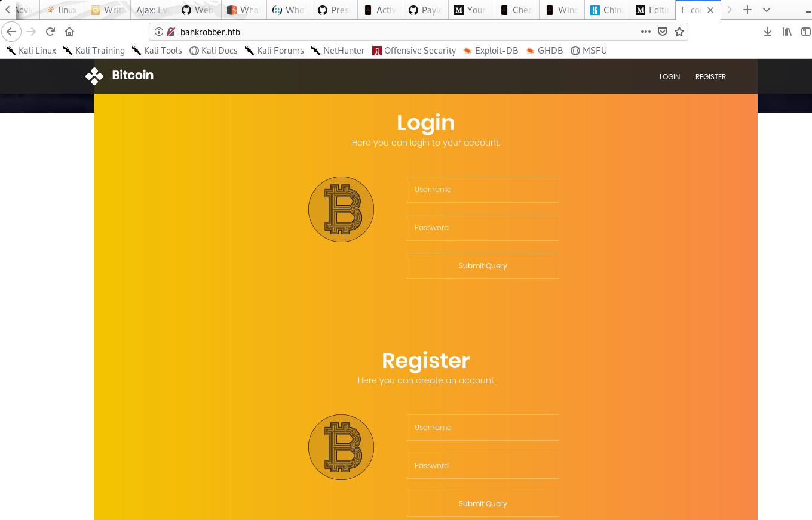

# BankRobber

### Reconnaissance
We know that this is a Windows box already from the description and can just as easily determine that from our next step.

Here is where I crank up good old faithful, the tool that is almost as old as the internet itself, Nmap, to initate a SYN- stealth scan and probe common TCP ports to identify some services on this box.

We see here that HTTP/s web servies are available on this host at standard ports 80 and 443, a MYSQL database on 3306 as well as a open port on 445 standard SMB.
Well since the name of the challenge is BankRobber, I think it is pretty safe to assume their is a bank involved. So lets surf over to the web site and have a looksee at this bank's authentication mechanisms and see if we can break her.

### Weaponization
Intruder develops malware designed to exploit the vulnerability

### Delivery
Intruder transmits the malware via a phishing email or another medium

### Exploitation
The malware begins executing on the target system

### Installation
The malware installs a backdoor or other ingress accessible to the attacker

### Command and Control
The intruder gains persistent access to the victim’s systems/network

### Actions on Objective
Intruder initiates end goal actions, such as data theft, data corruption, or data destruction
