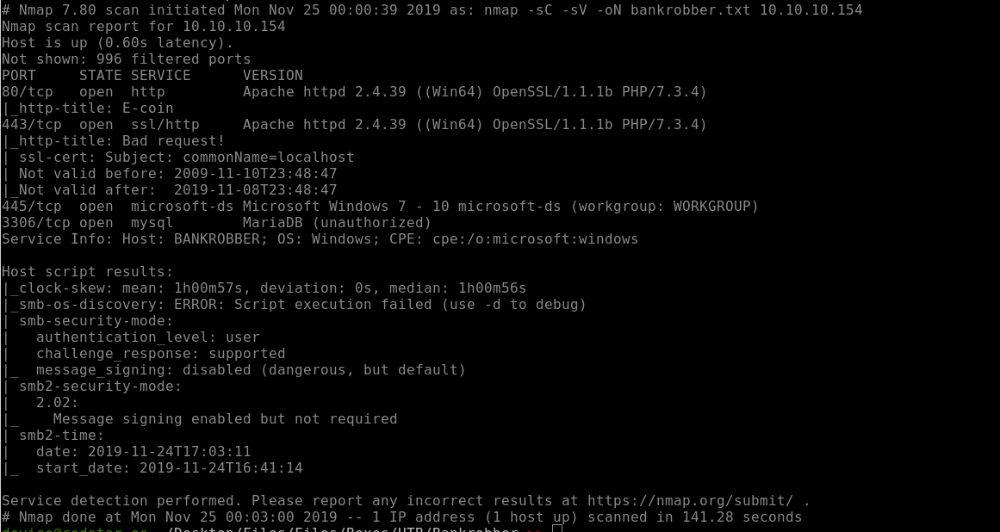

# BankRobber

This was my first active box on HTB I rooted, and it's rated as insanely difficult. Took me about a week of late night excursions in total isolation while I worked my day job 9 to 5 until I was able to pop her. I liked this box a lot because it consisted of vulnerabilites that I already knew how to find and exploit. Only one issue was the box required a bot to inpersonate a admin user and the response time for this was so horrible I almost gave up.

### Reconnaissance

Well, before any PT, you first must know what is the scope of the engagument. We know that this is a Windows host already from the description card.HTB provides the IP address of our target. We can now run nmap a good old faithful tool that is almost as old as the internet itself. We set it to initate a SYN stealth scan and probe common TCP ports to discover some services on this box.

We see here that HTTP/s web services are available on this host at standard ports 80 and 443, a MYSQL database on 3306 as well as a open port on 445 standard SMB which is another way to determine the likelyness this is a Windows machine.

Since the name of the challenge is BankRobber, I think it is pretty safe to assume their is a bank involved. So lets load up our HTTP proxy burp suite and surf over to the web site and have a look-see at this Bank and see what she is made of.

### Weaponization
Intruder develops malware designed to exploit the vulnerability

### Delivery
Intruder transmits the malware via a phishing email or another medium

### Exploitation
The malware begins executing on the target system

### Installation
The malware installs a backdoor or other ingress accessible to the attacker

### Command and Control
The intruder gains persistent access to the victim’s systems/network

### Actions on Objective
Intruder initiates end goal actions, such as data theft, data corruption, or data destruction
