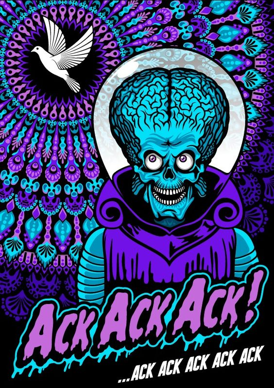
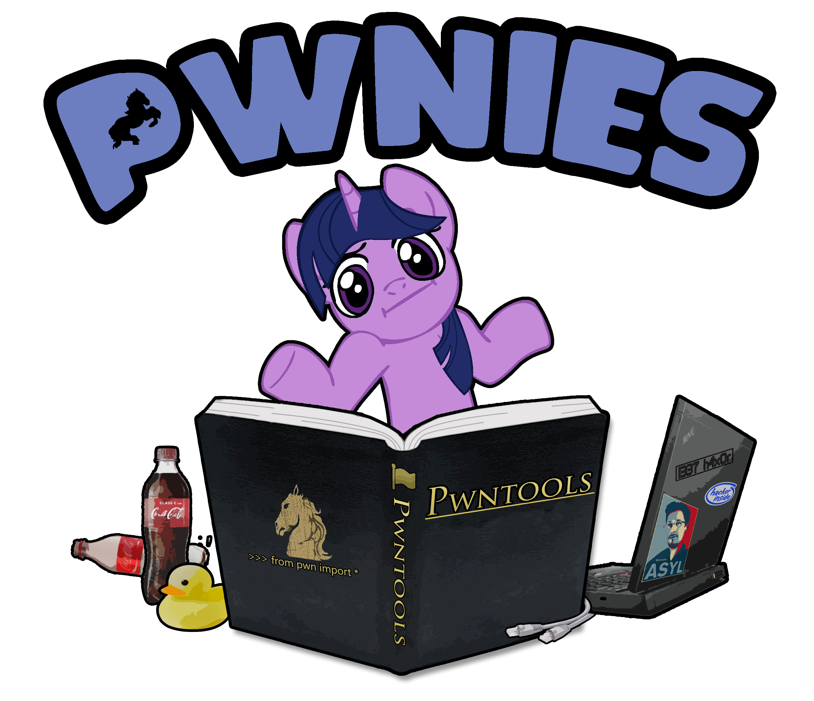

<link href="https://fonts.googleapis.com/icon?family=Material+Icons" rel="stylesheet">

<ul>
    
    <h1>Scatterbrain</h1>
    <b>Penetration Tester</b>  
  <i class="material-icons">&#xe55c; </i> USA
<a href="mailto:hack.this.0n3@gmail.com" size="5">
<meta itemprop="email" content="hack.this.0n3@gmail.com">Email</a>
<a href="https://keybase.io/scatterbrain" itemprop="sameAs" rel="nofollow noopener noreferrer" size="5">Keybase</a>
<a href="https://twitter.com/" itemprop="sameAs" rel="nofollow noopener noreferrer" size="5">Twitter</a>
<a href="https://github.com/Scatter-Security" itemprop="sameAs" rel="nofollow noopener noreferrer" size="5">GitHub</a>
    </ul>

<button class="showButton" id="aButton" onclick="openNav();">☰Menu</button>
<button class="closeButton" id="cButton" onclick="closeNav();">☰Hide</button>

<a href="index.html">Home</a><a href="#">Post</a><a href="#">Categories</a><a href="#">Tags</a><a href="#">About</a><a href="#">Affiliates</a>

    
<h3> Short Bio about Me:</h3>

Hello to the good, the bad, and the beautiful people,
 

Welcome to my page, you have now reached the end of the internet and if you somehow made it here by mistake, it's not too late to hit the `X` in the corner before you get submerged! So a little 'bit' or a 'byte' about me, I make cornball jokes! Oh, and I like to break into things most people claim secure, without malice, for the challenge. If you prefer, you can address me by one of the many handles that I mask my identity with and change almost as often as my underwear. My full-story will soon be available when my new book gets published in 'Nevuary'. Where I am from they might say something like "Game is sold, not told". Unless it's about a hack cause that's the type of knowledge too juicy to withhold!

<h2> Write-ups</h2>

<pre>This is where I will be posting my write-ups for my digital adventures on <a href="https://hackthebox.eu">[Hack the box]</a></pre>

<b>Bankrobber</b>
  
<pre>This is a insane web app box that can be solved with some essential OWASP top 10 knowledge to get a user shell, and some basic binary exploitation to esculate to root.</pre>

<b>JSON</b>

This was a medium-difficulty. For the initial shell, you need to identify a vulnerability related to JSON-based deserialization on the website, and by leveraging this issue incorporated with a Bearer: header, you can get a RCE on the box. For the root shell, you can leverage a permissive permission configured for the initial user, <code>SeImpersonatePrivilege</code>, to perform a JuicyPotato exploit to get a SYSTEM shell.

Hella Secure Corp. © 2020 and beyond

